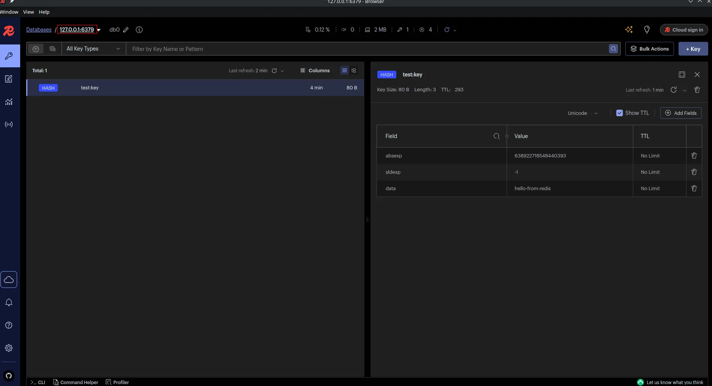

# PAKETLER

- Microsoft.Extensions.Caching.StackExchangeRedis

# Docker ile Redis

```shell
docker run -d --name redis -p 6379:6379 redis
```

Redis’i ayağa kaldırdıktan sonra, sadece Program.cs içerisine gerekli konfigürasyonu eklemeniz yeterlidir. Bu sayede
verileriniz local ortamda Redis’e kaydedilecektir.


Ayrıca Redis Insight uygulaması ile de verilerinizi inceleyebilirsiniz ve testlerinizi yapabilirsiniz.

# Redis

.NET projelerinde Redis kullanımı için iki farklı yaklaşımı özetler:  
**`IDistributedCache`** ve **`StackExchange.Redis`**.

## IDistributedCache

- **Microsoft.Extensions.Caching.Distributed** namespace’i altında gelir.
- **Abstraction (soyutlama)** sağlar.
- Redis dışında **SQL Server cache**, **NCache**, **Memory cache** gibi farklı implementasyonlarla da kullanılabilir.
- Basit CRUD tarzı methodlar sunar:
    - `GetStringAsync`
    - `SetStringAsync`
    - `RemoveAsync`

👉 Avantaj: Kolay kullanım, provider bağımsız.  
👉 Dezavantaj: Gelişmiş Redis özelliklerini (pub/sub, list, hash, stream vs.) desteklemez.

---

## StackExchange.Redis

- Redis için **low-level, güçlü bir kütüphane**.
- Microsoft’un önerdiği **resmi Redis client**.
- Çok daha fazla method ve veri yapısını destekler:
    - String, Hash, List, Set, Sorted Set
    - Pub/Sub (mesajlaşma)
    - Transactions, Pipelining
    - Lua scripting

👉 Avantaj: Redis’in tüm özelliklerine erişim.  
👉 Dezavantaj: Redis’e sıkı sıkıya bağlı (abstraction yok). Başka bir cache sağlayıcısına geçmek zor olur.

---

## 3. Ne Zaman Hangisi?

- **Sadece basit cache (key-value) lazımsa**  
  → `IDistributedCache` yeterli olur.

- **Redis’in gelişmiş özelliklerini (listeler, pub/sub, stream) kullanmak istiyorsan**  
  → `StackExchange.Redis` kullanmalısın.

# MediatR Caching Behavior

Bu proje, MediatR pipeline davranışları (Behavior) kullanarak **cache mekanizmasını merkezi ve tekrar kullanılabilir şekilde** yönetir.

## Neden MediatR Behavior ile Cache?

* **Classic yaklaşımlar:** Her handler içinde cache kontrolü ve cache’e yazma kodunu yazmak zorundaydık.
  Örnek: `GetAllProductsHandler` veya `GetProductByIdHandler` içinde sürekli `IDistributedCache` erişimi, JSON serialize/deserialize, expiration ayarları vs.
* **Dezavantajları:**

    * Kod tekrarına (duplication) yol açar.
    * Handler’lar artık sadece iş mantığını değil, cache detaylarını da yönetmek zorunda kalır.
    * Cache stratejisini değiştirmek (Redis → MemoryCache gibi) tüm handler’ları güncellemek anlamına gelir.

---

## Behavior ile Çözüm

* `CachingBehavior<TRequest, TResponse>` sınıfı, pipeline’daki tüm request’ler için **cache kontrolü ve cache’e yazma işlemini tek noktadan** yapar.
* Sadece `ICacheable` implement eden request’ler cache’e alınır.
* Handler’lar **yalnızca iş mantığını** yazar, cache kodu ile uğraşmaz.

### Avantajları

1. **Tekrarsız kod** – Tüm caching işlemleri merkezi.
2. **Kolay yönetim** – Cache stratejisi değişirse sadece behavior güncellenir.
3. **Temiz handler’lar** – Handler sadece veri erişim ve iş mantığına odaklanır.
4. **Esneklik** – Yeni query/command eklemek için sadece `ICacheable` implement etmek yeterli.

---

Bu sayede, klasik handler içi cache kodlarından kurtulduk ve projemiz **daha sürdürülebilir, temiz ve merkezi cache yönetimli** bir yapıya kavuştu.


