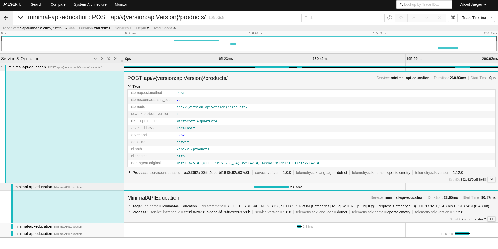

# Minimal API – Endpoint Pattern

Bu proje, **.NET Minimal API** kullanarak endpoint’lerde **temiz ve okunabilir HTTP response yönetimi** sağlar.

---

## Yapının Özeti

* Endpoint’lerde switch-case veya uzun if blokları yazmadan **tek tip dönüş** sağlanıyor.
* Response’lar tip güvenli ve okunabilir.
* Swagger/OpenAPI uyumu için tüm olası status kodları `.Produces<...>` ile belgeleniyor.

---

### Endpoint Avantajları

* Endpoint’ler **tek satır ile dönüş** sağlıyor.
* Kod **temiz, kısa ve okunabilir**.
* İş kuralları ve validation hataları kolayca yönetilebiliyor.

---

### Güncellemede Unutulan Kısım => Duplicate Kontrolü

* Ürün güncelleme işlemleri sırasında:

    * İlgili kategori var mı kontrol edilir.
    * Ürün mevcut mu kontrol edilir.
    * Aynı isim ve kategoride başka bir ürün varsa **409 Conflict** veya **400 BadRequest** dönülür.
    * Güncelleme başarılıysa **204 NoContent** dönülür.

---

Bu resimde aradaki kod farkını görebilrisiniz her endpointe switch yazmaktan bizi kurtardı